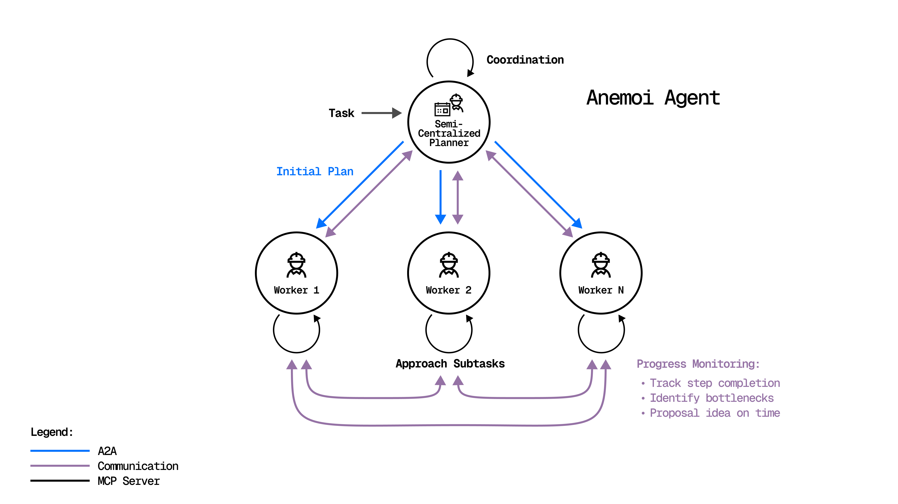
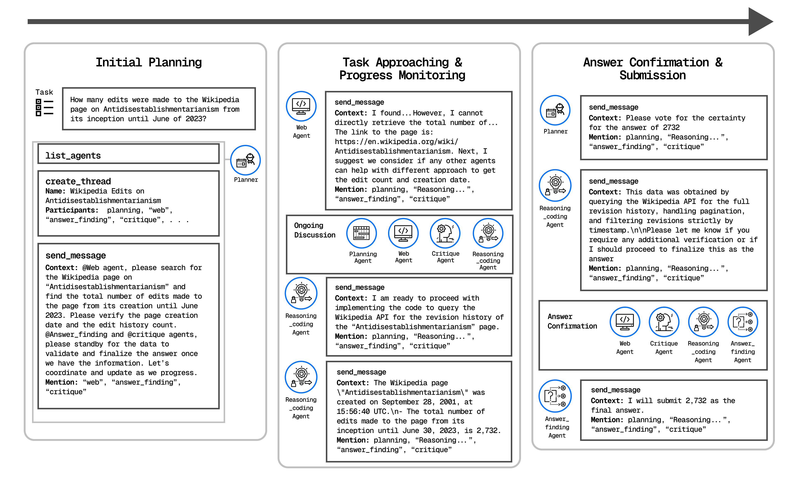

# Anemoi: A Semi-Centralized Multi-agent Systems Based on Agent-to-Agent Communication MCP server

**Anemoi** is a semi-centralized multi-agent system (MAS) built on a **Agent-to-Agent (A2A) communication MCP server**.
Unlike traditional **context-engineering + centralized** paradigms, Anemoi introduces **structured, direct inter-agent communication** — enabling agents to collaborate much like a real-world team.

🌬️ *Like winds connecting distant lands, Anemoi enables agents to communicate directly in a semi-centralized network, achieving scalable coordination and seamless information flow.*

<p align="center">
  
</p>

---

## 🚀 Key Features

* **Semi-Centralized Architecture**
  Reduces dependency on a single planner agent, supporting adaptive plan updates.

* **Direct Agent-to-Agent Collaboration**
  Agents can monitor progress, assess results, identify bottlenecks, and propose refinements in real time.

* **Efficient Context Management**
  Minimizes redundant prompt concatenation and information loss, improving scalability and cost-efficiency.

* **Benchmark Performance**
  Achieved **52.73% accuracy** on the validation set of the GAIA benchmark, setting the **state-of-the-art** among small-LLM-based systems.

  > Surpasses OWL (43.63%) by **+9.09%** in the same worker agents and models configuration (gpt-4.1-mini as planner agent/ gpt-4o as worker agent).

<p align="center">
  
</p>

---

## Reproduction

Set up environment variables:

```
echo '
export FIRECRAWL_API_KEY="your_firecrawl_api_key"
export GOOGLE_API_KEY="your_google_api_key"
export HF_HOME="your_hf_home_path"
export OPENROUTER_API_KEY="your_openrouter_api_key"
export SEARCH_ENGINE_ID="your_search_engine_id"
export CHUNKR_API_KEY="your_chunkr_api_key"
' >> ~/.bashrc && source ~/.bashrc
```

Create environment:

```
cd Anemoi
/usr/bin/python3.12 -m venv venv
source venv/bin/activate
pip install -r requirements.txt
```

We made some minor modifications to CAMEL 0.2.70 for our experiments:

```
rm -rf venv/lib/python3.12/site-packages/camel
cp -r utils/camel venv/lib/python3.12/site-packages/
```

Run the experiment:

```
cd ..
./gradlew run --console=plain
```


